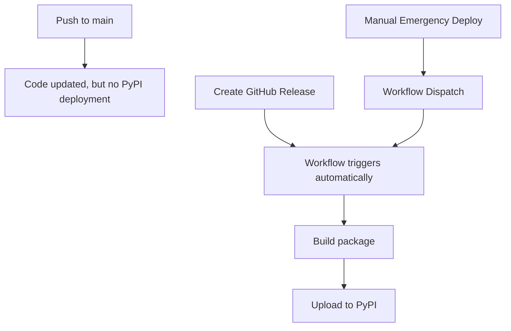

# PyPI Deployment Quick Reference

## The Issue: "Why didn't my push to main deploy to PyPI?"

**Answer**: PyPI deployment is **release-based**, not push-based. This is intentional for security and control.

## Quick Fix: Deploy Current Version (16.2.0)

1. **Run the helper script**:
   ```bash
   python scripts/create_release.py
   ```
   
2. **Click the generated link** to create a GitHub release

3. **Publish the release** - PyPI deployment starts automatically

## How It Works



## Future Deployments

For every new version:
1. Update `VERSION.md` and `pyproject.toml` 
2. Update `CHANGELOG.md`
3. Run `python scripts/create_release.py`
4. Create the GitHub release
5. PyPI deployment happens automatically

## Emergency Manual Deployment

If you need immediate deployment without a release:
- Go to: https://github.com/sgttomas/chirality-framework/actions/workflows/python-publish.yml
- Click "Run workflow"
- Type exactly: `deploy-to-pypi`
- Click "Run workflow"

---
*This process ensures all deployments are tracked, versioned, and documented through GitHub releases.*